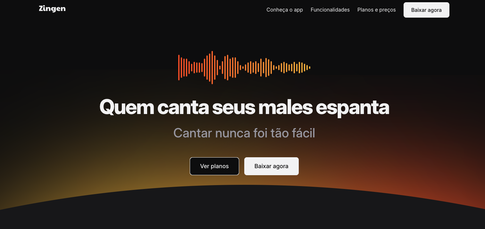
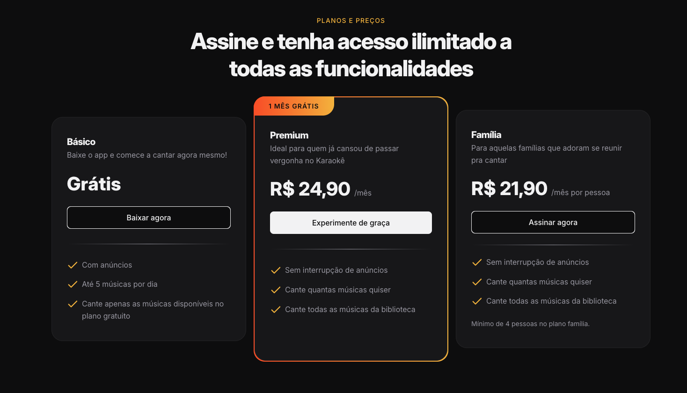

## Zingen - Landing page de app de Karaokê

Projeto de **landing page responsiva** para o aplicativo fictício de karaokê **Zingen**.  
O objetivo é praticar HTML e CSS modernos, compondo uma página única com seções como hero, sobre, funcionalidades, planos e download do app.

---
```markdown
## Prévia da landing page
```


## ✨ Visão geral

- **Tipo de projeto**: Landing page estática (somente HTML + CSS)
- **Público alvo**: Pessoas interessadas em cantar e melhorar a performance no karaokê
- **Principais seções**:
  - **Header** com navegação por âncoras
  - **Hero** com chamada principal e botões de ação
  - **Sobre o app** (`#about`)
  - **Funcionalidades** (`#features`)
  - **Planos e preços** (`#pricing`)
  - **Download** (`#download`)
  - **Rodapé** com links e redes sociais

---
```markdown
## 📸 Prévia do layout

![Tela inicial do Zingen]
```


---

## 🧱 Estrutura básica do projeto

```text
zingen/
├── index.html
├── styles/
│   ├── index.css
│   ├── global.css
│   ├── hero.css
│   ├── about.css
│   ├── features.css
│   ├── pricing.css
│   ├── download.css
│   ├── footer.css
│   ├── buttons.css
│   ├── cards.css
│   ├── social.css
│   ├── sections.css
│   └── utility.css
└── assets/
    ├── bg-hero-desktop.svg
    ├── illustration.svg
    ├── music-bars.svg
    ├── smartphones.png
    ├── icon/
    │   ├── logo.svg
    │   ├── MagicWand.svg
    │   ├── GameController.svg
    │   ├── MicrophoneStage.svg
    │   ├── UsersThree.svg
    │   ├── MusicNotes.svg
    │   ├── twitter.svg / twitter-hover.svg
    │   ├── instagram.svg / instagram-hover.svg
    │   ├── tiktok.svg / tiktok-hover.svg
    │   ├── discord.svg / discord-hover.svg
    │   ├── button-apllestore.svg
    │   └── button-playstore.svg
    └── (demais imagens usadas nas seções)
```

---

## 🚀 Como visualizar o projeto

Como é um projeto estático, **não é necessário backend nem servidor complexo**.

### Opção 1: Abrir direto no navegador

1. Baixe/cloned este repositório.
2. Abra o arquivo `index.html` clicando duas vezes ou arrastando para o navegador.

### Opção 2: Usar uma extensão de Live Server (VSCode/Cursor)

1. Instale a extensão **Live Server**.
2. Clique com o botão direito em `index.html`.
3. Selecione **"Open with Live Server"**.
4. O navegador vai abrir o projeto em um endereço como `http://127.0.0.1:5500`.

---

## 🧩 Tecnologias utilizadas

- **HTML5 semântico**
- **CSS3** com:
  - Variáveis CSS (`:root`) para cores, espaçamentos e tipografia
  - Layout com **flexbox** e **grid**
  - Responsividade com **media queries**
- Fonte **Inter** via Google Fonts

---

## 📚 Seções principais do layout

- **Header**: navegação com links âncora para as seções da página.
- **Hero**: título principal, subtítulo e botões de ação.
- **Sobre o app (`#about`)**: apresenta a proposta do Zingen e os benefícios do uso da IA.
- **Funcionalidades (`#features`)**: cards destacando biblioteca de músicas, gamificação, gravação, comunidade e letras em tempo real.
- **Planos e preços (`#pricing`)**: cards para os planos Básico, Premium e Família, com CTA para download/experiência gratuita.
- **Download (`#download`)**: chamada final para baixar o app com botões para Apple Store e Play Store.
- **Footer**: links de produto, empresa, legal e ícones de redes sociais.

---

## 🛠 Como customizar

- **Cores e tipografia**: editar as variáveis em `styles/global.css` dentro de `:root`.
- **Espaçamentos e utilitários**: ajustar as classes utilitárias em `styles/utility.css`.
- **Componentes (botões, cards, etc.)**: alterar os estilos em `styles/buttons.css`, `styles/cards.css` e arquivos específicos de seção.
- **Conteúdo textual**: modificar títulos, parágrafos e listas diretamente em `index.html`.

---

## 🤝 Contribuição

Sugestões de melhoria, ajustes de layout ou acessibilidade são bem-vindas.  
Você pode:

- Abrir uma **issue** descrevendo o que gostaria de mudar; ou
- Criar um **fork**, fazer as alterações e abrir um **Pull Request**.

---

> Este projeto foi desenvolvido para fins de estudo e prática de HTML/CSS.

